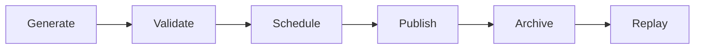

# Daily Logic Challenge

# Game Design Specification

**Document ID:** GDD-001

**Version:** 1.0.0

**Status:** Approved

**Owner:** Product Team

---

# 1. Purpose

This document defines the gameplay mechanics, puzzle rules, scoring, interaction model, and game flow for Daily Logic Challenge.

It serves as the authoritative specification for all gameplay-related implementation.

Implementation details such as APIs, database schema, and UI framework are intentionally documented elsewhere.

---

# 2. References

- 000-project-charter.md
- 001-prd.md
- decision-log.md

---

# 3. Game Overview

Daily Logic Challenge is a web-based Binary Puzzle game.

Every UTC day, one official puzzle is published.

All players receive exactly the same puzzle.

Players compete to solve it:

- as fast as possible
- with the fewest moves

---

# 4. Game Objectives

The objective is to complete the Binary Puzzle while satisfying every puzzle rule.

A puzzle is considered complete only when every validation rule succeeds.

---

# 5. Binary Puzzle Rules

The following rules define a valid solution.

---

## GR-001

Every cell contains either:

- 0
- 1

No other values are permitted.

---

## GR-002

Every row shall contain an equal number of:

- 0
- 1

---

## GR-003

Every column shall contain an equal number of:

- 0
- 1

---

## GR-004

More than two identical values may never appear consecutively.

Valid

```
001100
```

Invalid

```
000110
```

---

## GR-005

Every row shall be unique.

No duplicate rows are allowed.

---

## GR-006

Every column shall be unique.

No duplicate columns are allowed.

---

## GR-007

Every puzzle shall have exactly one valid solution.

---

# 6. Difficulty Levels

The game supports three difficulty levels.

---

## Easy

Grid Size

6 × 6

Target Completion

2–4 minutes

---

## Medium

Grid Size

8 × 8

Target Completion

4–7 minutes

---

## Hard

Grid Size

10 × 10

Target Completion

7–10 minutes

---

Difficulty is determined when the daily puzzle is scheduled.

---

# 7. Daily Puzzle Lifecycle



---

Generation occurs before publication.

Every generated puzzle shall pass uniqueness validation.

---

# 8. Player Interaction

Players interact only with editable cells.

Fixed cells cannot be modified.

---

## Cell States

Each cell exists in one of the following states.

| State | Editable |
|---------|-----------|
| Fixed | No |
| Empty | Yes |
| 0 | Yes |
| 1 | Yes |

---

## Cell Interaction

Desktop

Mouse click cycles:

```
Empty

↓

0

↓

1

↓

Empty
```

Mobile

Tap cycles using the same sequence.

---

# 9. Move Definition

A move is recorded every time the player changes the value of a cell.

Examples

Empty → 0

counts as one move.

0 → 1

counts as one move.

1 → Empty

counts as one move.

---

# 10. Timer

The timer begins:

- on the player's first move.

The timer ends:

- automatically when the puzzle reaches a valid solved state.

The timer never pauses.

---

# 11. Immediate Validation

After every move the game validates:

- three consecutive identical values
- row balance
- column balance
- duplicate rows (when complete)
- duplicate columns (when complete)

Invalid cells are highlighted immediately.

Immediate validation never ends the game.

---

# 12. Completion

The puzzle completes automatically when:

- every cell is filled
- every rule succeeds

When the board becomes a completion candidate, the frontend automatically calls the documented completion API. The backend remains authoritative for final validation and score acceptance.

The player never presses a Submit button.

---

# 13. Scoring

Primary ranking

Completion Time

Tie Breaker 1

Total Moves

Tie Breaker 2

Earliest Completion Timestamp

---

# 14. Replay

Players may replay puzzles indefinitely.

Replay resets:

- board
- timer
- move counter

Replay never changes:

- puzzle
- solution
- difficulty

Only the player's best result is submitted to the leaderboard.

---

# 15. Archive

Archived puzzles remain playable.

Archived puzzles update:

- Games Played
- Games Completed
- Personal Best
- Average Time
- Average Moves

Archived puzzles never modify historical leaderboard positions.

---

# 16. Guest Players

Guest players may:

- play today's puzzle
- replay today's puzzle

Guest players may not:

- appear on leaderboards
- save statistics
- maintain streaks

---

# 17. Error Handling

If puzzle loading fails:

Display an error message.

Allow retry.

---

If leaderboard submission fails:

Puzzle completion remains valid.

Submission should be retried.

---

If authentication expires:

Prompt the user to authenticate again.

---

# 18. Future Extensions

The gameplay engine should allow future support for:

- hints
- achievements
- additional puzzle sizes
- additional puzzle types
- tournaments
- seasonal events

without redesigning the core gameplay engine.

---

# 19. Glossary

Editable Cell

A cell that the player may modify.

Fixed Cell

A clue provided as part of the published puzzle.

Move

Any change to a cell value.

Puzzle

A Binary Puzzle with exactly one valid solution.

Replay

Restarting the same published puzzle.

---

# End of Game Design Specification
