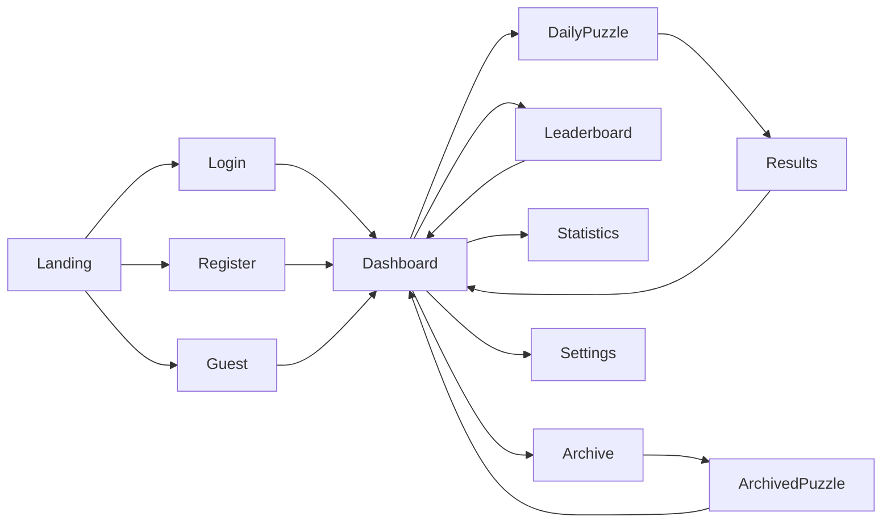

# Daily Logic Challenge

# User Interface & User Experience Specification

**Document ID:** UIUX-001

**Version:** 1.0.0

**Status:** Approved

---

# 1. Purpose

This document defines the user experience, navigation, screen layouts, interaction patterns, and accessibility expectations for Daily Logic Challenge.

Implementation details such as Angular components, CSS frameworks, and styling are intentionally excluded.

---

# 2. Design Principles

The application shall prioritize:

- Simplicity
- Speed
- Accessibility
- Consistency
- Responsiveness

The game should require little to no explanation for first-time players.

---

# 3. Global Navigation



---

# 4. Screen Inventory

| Screen ID | Name |
|------------|------|
| SCR-001 | Landing |
| SCR-002 | Login |
| SCR-003 | Register |
| SCR-004 | Dashboard |
| SCR-005 | Daily Puzzle |
| SCR-006 | Results |
| SCR-007 | Leaderboard |
| SCR-008 | Statistics |
| SCR-009 | Archive |
| SCR-010 | Settings |

---

# 5. Screen Specifications

---

## SCR-001 – Landing Page

Purpose

Introduce the application.

Primary Actions

- Play as Guest
- Login
- Register

Displayed Information

- Game logo
- Short description
- Current daily challenge
- Navigation

---

## SCR-002 – Login

Fields

- Email
- Password

Actions

- Login
- Login with Google
- Forgot Password
- Register

---

## SCR-003 – Register

Fields

- Username
- Email
- Password
- Confirm Password

Actions

- Register
- Login

---

## SCR-004 – Dashboard

Purpose

Central navigation hub.

Sections

Today's Puzzle

Current streak

Personal best

Quick statistics

Navigation cards

- Play
- Leaderboard
- Archive
- Statistics
- Settings

---

## SCR-005 – Daily Puzzle

The primary gameplay screen.

Contains

Puzzle board

Move counter

Elapsed timer

Difficulty

Validation feedback

Restart button

Exit button

---

## SCR-006 – Results

Displays

Completion time

Move count

Difficulty

Personal best indicator

Leaderboard position

Buttons

Replay

Dashboard

Leaderboard

---

## Completion Finalization

The puzzle screen must not expose a Submit button. When the board becomes a completion candidate, the frontend automatically finalizes the attempt through the documented completion API and then routes to the Results screen if the backend accepts the solution.

---

## SCR-007 – Leaderboard

Displays

Rank

Username

Completion time

Moves

Completion timestamp

Supports

Pagination

Refresh

---

## SCR-008 – Statistics

Displays

Games Played

Games Completed

Best Time

Average Time

Average Moves

Current Streak

Longest Streak

Completion Rate

---

## SCR-009 – Archive

Displays

Chronological list of previous puzzles.

Each entry includes

Date

Difficulty

Completion status

Replay button

---

## SCR-010 – Settings

Future expansion.

MVP

- Logout
- Theme (placeholder)
- About

---

# 6. Primary Navigation

The application should never require more than three interactions to reach any primary feature.

---

# 7. Puzzle Screen Layout

```text
+----------------------------------------------------+

 Today's Puzzle

 Difficulty: Medium

 Time: 02:14

 Moves: 37

------------------------------------------------------

        Puzzle Grid

------------------------------------------------------

Restart     Exit

+----------------------------------------------------+
```

---

# 8. Responsive Behavior

Desktop

Sidebar navigation permitted.

Tablet

Navigation collapses into top menu.

Mobile

Single-column layout.

Puzzle remains centered.

---

# 9. Interaction Model

Mouse

Click cell

Cycle value

Keyboard

Arrow keys

Move selection

0

Place zero

1

Place one

Delete

Clear cell

Space

Cycle value

Touch

Tap

Cycle value

Long press

Reserved for future features.

---

# 10. Validation Feedback

Valid cells

Normal appearance.

Invalid cells

Highlighted immediately.

Fixed cells

Visually distinct.

Selected cell

Clearly focused.

---

# 11. Notifications

Examples

Puzzle completed

Authentication expired

Network error

Leaderboard updated

Notifications should be brief and non-blocking.

---

# 12. Loading States

Every asynchronous operation shall display feedback.

Examples

Loading puzzle...

Loading leaderboard...

Saving score...

---

# 13. Error States

Puzzle unavailable

Retry

Leaderboard unavailable

Retry

Authentication expired

Redirect to login

---

# 14. Empty States

Leaderboard

"No scores yet."

Archive

"No archived puzzles available."

Statistics

"Play your first puzzle."

---

# 15. Accessibility

The interface shall support

Keyboard navigation

Screen readers

Visible focus indicators

High contrast

ARIA labels

No color-only feedback

---

# 16. Future UX Enhancements

Animations

Achievements

Themes

Custom avatars

Puzzle sharing

Sound effects

---

# End of UI/UX Specification
