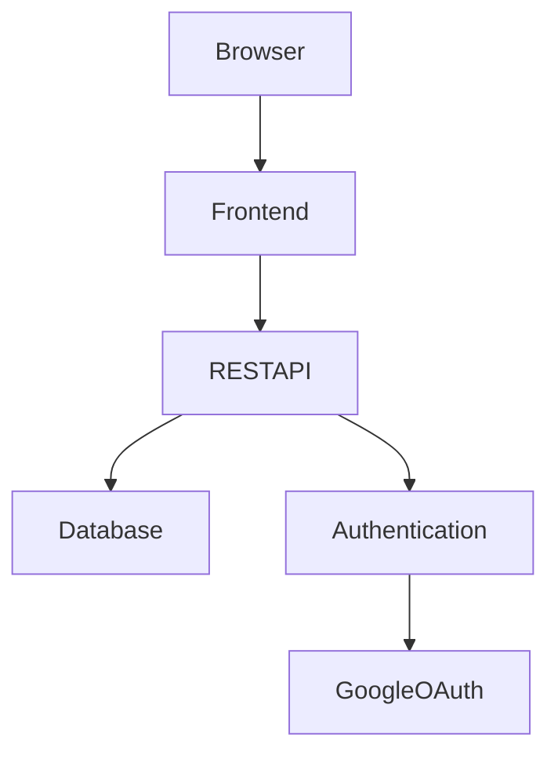
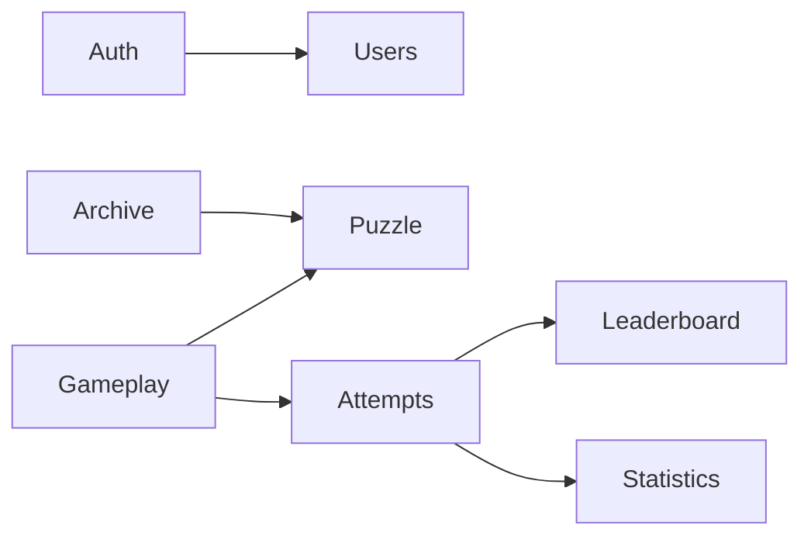
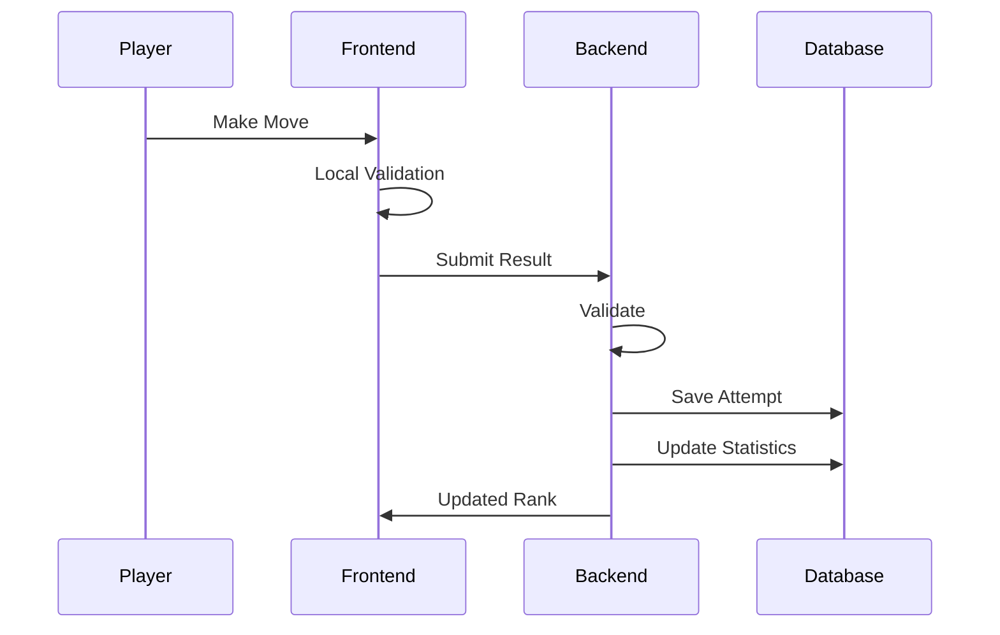

# Daily Logic Challenge

# Software Architecture

**Document ID:** ARCH-001

**Version:** 1.0.0

**Status:** Approved

---

# 1. Purpose

This document defines the software architecture of Daily Logic Challenge.

It describes the logical structure of the application, module boundaries, deployment topology, and architectural decisions.

Implementation details are intentionally documented elsewhere.

---

# 2. Architectural Goals

The architecture shall prioritize:

- Simplicity
- Maintainability
- Testability
- Extensibility
- Independent feature development
- AI-agent collaboration

---

# 3. High-Level Architecture



---

# 4. Architectural Style

The application adopts a Modular Monolith architecture.

Reasons

- Lower operational complexity
- Easier deployment
- Better suited for MVP
- Easier local development
- Straightforward migration to microservices

---

# 5. Major Components

Frontend

Backend

Database

Authentication Provider

Deployment Environment

---

# 6. Frontend Responsibilities

The frontend shall be responsible for:

Rendering UI

Managing local state

Calling backend APIs

Authentication session

Input validation

Accessibility

Responsive layouts

The frontend shall not contain business rules.

---

# 7. Backend Responsibilities

The backend owns:

Authentication

Puzzle validation

Scoring

Scheduling

Statistics

Leaderboard

Persistence

Business rules

---

# 8. Database Responsibilities

Persistent storage

User information

Puzzle metadata

Attempts

Statistics

Leaderboard

Scheduling

---

# 9. External Services

Google Authentication

Optional Email Service

---

# 10. Module Diagram



---

# 11. Backend Modules

Authentication

Responsible for:

Registration

Login

JWT

Google

---

Users

Responsible for:

Profile

Preferences

Account

---

Puzzle

Responsible for:

Daily puzzles

Archive

Scheduling

Loading

---

Gameplay

Responsible for:

Move validation

Completion

Timer

Scoring

---

Attempts

Responsible for:

Saving attempts

Replay

History

---

Leaderboard

Responsible for:

Ranking

Ordering

Best score

---

Statistics

Responsible for:

Player statistics

Streaks

Performance

---

Archive

Responsible for:

Historical puzzles

Replay

Filtering

---

Administration

Future feature.

---

# 12. Frontend Modules

Core

Shared

Authentication

Play

Leaderboard

Statistics

Archive

Profile

Settings

---

# 13. Layered Architecture

```text
Presentation

↓

Application

↓

Domain

↓

Infrastructure
```

---

Presentation

UI

Controllers

Application

Use Cases

Services

Domain

Rules

Validation

Entities

Infrastructure

Database

Authentication

REST

---

# 14. Data Flow



---

# 15. Security

Authentication required for:

Leaderboard

Statistics

Profile

Guest users:

No persistence

No leaderboard

---

# 16. Error Handling

Graceful failures

Retry operations

Consistent error responses

No application crashes

---

# 17. Logging

Frontend

User-facing errors only.

Backend

Structured logs.

Audit logs for:

Authentication

Puzzle completion

Leaderboard updates

---

# 18. Scalability

Future modules should be addable without modifying existing modules.

---

# 19. Future Evolution

Potential microservices:

Authentication

Puzzle Generation

Leaderboard

Notification

Analytics

---

# End of Architecture Document
