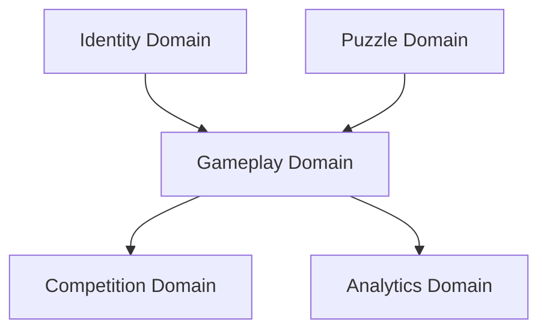
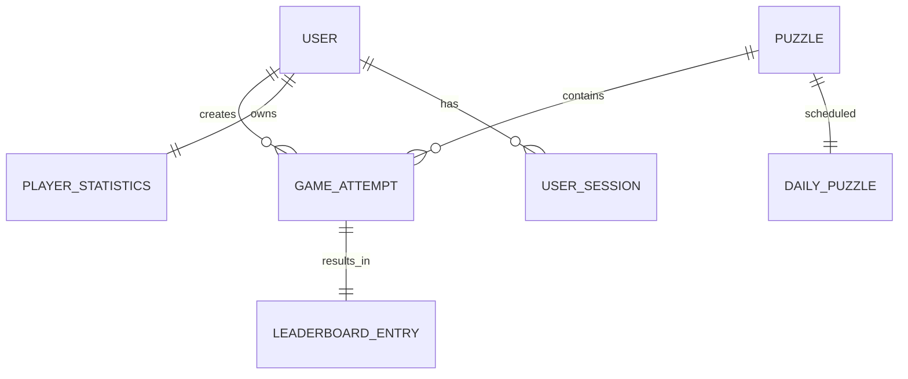
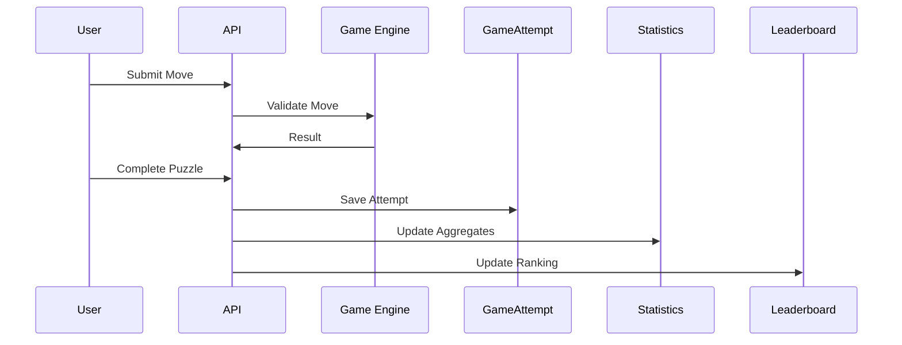
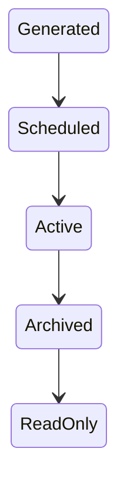
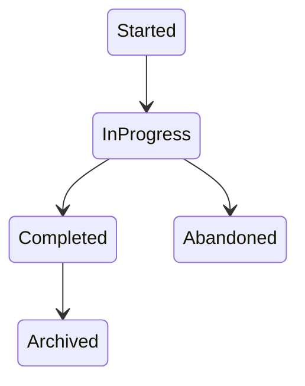

# Daily Logic Challenge

# Data Architecture Specification

**Document ID:** DATA-001  
**Version:** 1.0.0  
**Status:** Approved  
**Owner:** Backend Architecture Team  

---

# 1. Purpose

This document defines the data model, entity relationships, persistence strategy, and database design principles for Daily Logic Challenge.

It describes the **domain-level data architecture**, independent of any specific ORM or database engine implementation.

---

# 2. Design Principles

## DATA-PRINCIPLE-001

The database must reflect the **domain model**, not the UI or API structure.

---

## DATA-PRINCIPLE-002

All game outcomes must be traceable from immutable attempt records.

---

## DATA-PRINCIPLE-003

Statistics should be derived incrementally, not recomputed on every request.

---

## DATA-PRINCIPLE-004

Puzzles are immutable once published.

---

## DATA-PRINCIPLE-005

Leaderboards are derived from attempts and stored for fast read performance.

---

## DATA-PRINCIPLE-006

All timestamps are stored in UTC using ISO-8601 format.

---

# 3. Domain Overview

The system is composed of the following core domains:

---

# 4. Core Entities

The system is composed of 7 primary entities:

- User
- Puzzle
- DailyPuzzle
- GameAttempt
- PlayerStatistics
- LeaderboardEntry
- UserSession

---

# 5. Entity Model (Logical View)

---

# 6. Entity Definitions

---

## 6.1 User

Represents a registered player.

### Fields

- id (UUID)
- firebase_uid (string, unique)
- username (string, unique)
- email (string, unique)
- created_at (timestamp)
- updated_at (timestamp)

### Notes

Authentication is handled by Firebase. This table stores application-specific user metadata.

---

## 6.2 Puzzle

Represents a Binary Puzzle instance.

### Fields

- id (UUID)
- size (int)
- difficulty (enum: EASY | MEDIUM | HARD)
- grid (JSONB)
- solution (JSONB)
- hash (string)
- generated_at (timestamp)
- created_at (timestamp)
- updated_at (timestamp)

### Notes

- Immutable after creation
- `hash` ensures uniqueness of puzzle configuration
- `grid` contains initial state (including fixed cells)
- `solution` is stored for validation and analytics

---

## 6.3 DailyPuzzle

Maps a puzzle to a specific UTC date.

### Fields

- id (UUID)
- date (DATE, unique)
- puzzle_id (FK → Puzzle)
- created_at
- updated_at

### Notes

- Only one puzzle per UTC day
- Enables pre-generation of future puzzles

---

## 6.4 GameAttempt

Represents a single play session.

### Fields

- id (UUID)
- user_id (nullable for guest)
- puzzle_id
- started_at
- completed_at
- duration_ms
- move_count
- hint_count (future feature)
- is_completed (boolean)
- is_guest (boolean)
- created_at
- updated_at

### Notes

- This is the **core gameplay record**
- Every leaderboard and statistic derives from this entity

---

## 6.5 PlayerStatistics

Aggregated per-user performance metrics.

### Fields

- user_id (PK)
- games_played
- games_completed
- best_time_ms
- average_time_ms
- average_moves
- current_streak
- longest_streak
- updated_at

### Notes

- Updated incrementally after each completed attempt
- Avoids expensive aggregation queries

---

## 6.6 LeaderboardEntry

Stores best attempt per user per puzzle.

### Fields

- id (UUID)
- user_id
- puzzle_id
- attempt_id (best attempt reference)
- rank
- score_time_ms
- move_count
- created_at

### Notes

- Precomputed ranking for performance
- Immutable once computed
- Can be rebuilt from GameAttempt if scoring rules change

---

## 6.7 UserSession

Tracks user authentication activity.

### Fields

- id (UUID)
- user_id
- login_at
- logout_at
- device_info (JSONB)
- ip_address
- created_at

### Notes

- Firebase handles authentication
- This is for analytics and auditing only

---

# 7. Index Strategy

## USER

- username (unique)
- email (unique)
- firebase_uid (unique)

---

## GAME_ATTEMPT

- user_id
- puzzle_id
- completed_at
- is_completed

---

## PUZZLE

- hash (unique)
- difficulty
- size

---

## DAILY_PUZZLE

- date (unique)

---

## LEADERBOARD_ENTRY

- puzzle_id
- rank
- user_id

---

# 8. Data Flow Model

---

# 9. Data Lifecycle

## Puzzle Lifecycle

---

## Attempt Lifecycle

---

# 10. Constraints

## DATA-CONSTRAINT-001

A puzzle must have exactly one valid solution.

---

## DATA-CONSTRAINT-002

A DailyPuzzle must reference exactly one Puzzle.

---

## DATA-CONSTRAINT-003

A GameAttempt may reference null user_id (guest play).

---

## DATA-CONSTRAINT-004

LeaderboardEntry must reference a valid GameAttempt.

---

# 11. Aggregation Strategy

## PlayerStatistics Update Strategy

Updated after each completed attempt:

- Increment games_played
- Increment games_completed if successful
- Update best_time_ms if applicable
- Update averages using incremental formula
- Update streaks

---

# 12. Migration Strategy

- Use Prisma migrations (logical mapping layer)
- Schema changes must be backward compatible when possible
- Breaking changes require versioned migration scripts

---

# 13. Seed Strategy

Initial seed data includes:

- Sample users (dev only)
- Sample puzzles
- DailyPuzzle schedule for 7–30 days ahead (optional)

---

# 14. Future Extensions

The data model is designed to support:

- Tournament mode
- Seasonal leaderboards
- Hint tracking
- Puzzle difficulty recalibration
- Multi-game modes beyond Binary Puzzle
- Anti-cheat analysis layer

---

# 15. Ownership Map

| Entity | Domain |
|--------|--------|
| User | Identity |
| Puzzle | Puzzle |
| DailyPuzzle | Puzzle Scheduling |
| GameAttempt | Gameplay |
| PlayerStatistics | Analytics |
| LeaderboardEntry | Competition |
| UserSession | Identity / Analytics |

---

# 16. Summary

This data architecture defines the **single source of truth for all persistent state**.

All APIs, gameplay logic, statistics, and leaderboard calculations must derive from this model.

No feature should bypass or contradict this structure.

---

# End of Data Architecture Specification
