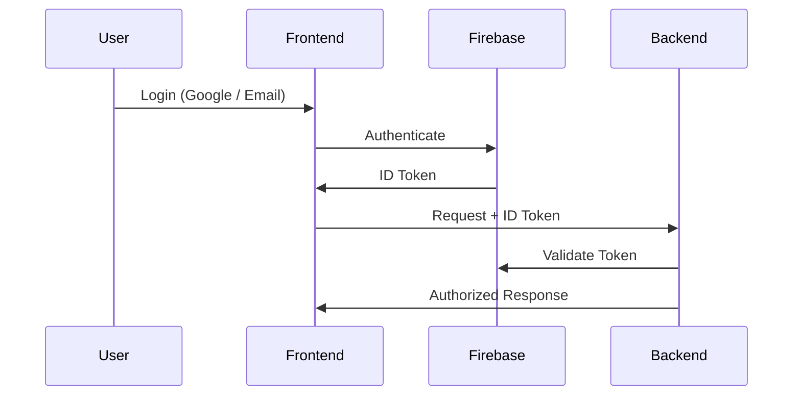
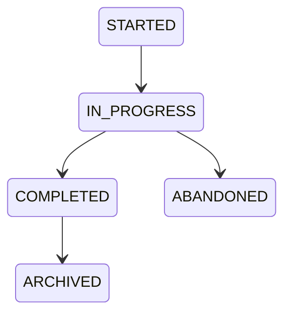

# Daily Logic Challenge

# API Specification

**Document ID:** API-001  
**Version:** 1.0.0  
**Status:** Approved  
**Owner:** Backend Architecture Team  

---

# 1. Purpose

This document defines the REST API contract for Daily Logic Challenge.

It includes:

- Authentication flow
- Game lifecycle endpoints
- Puzzle delivery
- Attempt submission
- Leaderboard access
- Statistics access
- Error handling model

This specification is **implementation-agnostic**, but optimized for a NestJS backend and Angular frontend.

---

# 2. API Design Principles

## API-PRINCIPLE-001

All endpoints must be stateless.

---

## API-PRINCIPLE-002

All timestamps must use UTC ISO-8601.

---

## API-PRINCIPLE-003

All responses must follow a consistent envelope format.

---

## API-PRINCIPLE-004

Authentication is handled via Firebase Identity Token.

Backend only validates tokens.

---

## API-PRINCIPLE-005

Game logic must never reside in the frontend.

Frontend is a client, not a validator.

---

# 3. Base URL

```
/api/v1
```

---

# 4. Authentication Model

## Flow



---

## Headers

```
Authorization: Bearer <firebase_id_token>
```

---

# 5. Standard Response Format

## Success

```json
{
  "success": true,
  "data": {},
  "meta": {}
}
```

---

## Error

```json
{
  "success": false,
  "error": {
    "code": "STRING_CODE",
    "message": "Human readable message",
    "details": {}
  }
}
```

---

# 6. Error Codes

| Code | Description |
|------|-------------|
| AUTH_INVALID_TOKEN | Firebase token invalid |
| AUTH_REQUIRED | Missing authentication |
| PUZZLE_NOT_FOUND | Puzzle does not exist |
| ATTEMPT_INVALID | Invalid game attempt |
| VALIDATION_FAILED | Move violates game rules |
| LEADERBOARD_ERROR | Ranking failure |
| INTERNAL_ERROR | Unexpected error |

---

# 7. Core Endpoints

---

# 7.1 Authentication Context

## GET /auth/me

Returns current user profile.

### Response

```json
{
  "success": true,
  "data": {
    "id": "uuid",
    "username": "player1",
    "email": "user@email.com"
  }
}
```

---

# 7.2 Puzzle Endpoints

---

## GET /puzzles/today

Returns today's puzzle.

### Response

```json
{
  "success": true,
  "data": {
    "date": "2026-07-05",
    "difficulty": "MEDIUM",
    "size": 8,
    "grid": [
      [1, null, 0],
      [null, 1, null]
    ]
  }
}
```

---

## GET /puzzles/{id}

Retrieve specific puzzle (archive use).

---

## GET /puzzles/history

Returns list of past puzzles.

---

# 7.3 Game Attempt Lifecycle

---

## POST /attempts/start

Creates a new attempt.

### Request

```json
{
  "puzzle_id": "uuid"
}
```

### Response

```json
{
  "success": true,
  "data": {
    "attempt_id": "uuid",
    "started_at": "timestamp"
  }
}
```

---

## POST /attempts/{id}/move

Submit a move.

### Request

```json
{
  "row": 2,
  "col": 3,
  "value": 1
}
```

### Response

```json
{
  "success": true,
  "data": {
    "valid": true,
    "game_state": "IN_PROGRESS",
    "move_count": 12
  }
}
```

---

## POST /attempts/{id}/complete

Finalize attempt.

This endpoint is called automatically by the frontend when the board is filled and the current puzzle state is a completion candidate. The player does not press a manual Submit button. The backend must validate the final state before accepting the score.

### Response

```json
{
  "success": true,
  "data": {
    "completed": true,
    "duration_ms": 234000,
    "moves": 45,
    "rank": 12
  }
}
```

---

## GET /attempts/{id}

Returns attempt state.

---

# 7.4 Leaderboard

---

## GET /leaderboard/today

Returns leaderboard for today’s puzzle.

### Response

```json
{
  "success": true,
  "data": [
    {
      "rank": 1,
      "username": "player1",
      "time_ms": 120000,
      "moves": 32
    }
  ]
}
```

---

## GET /leaderboard/{puzzleId}

Historical leaderboard.

---

# 7.5 Statistics

---

## GET /stats/me

Returns player statistics.

### Response

```json
{
  "success": true,
  "data": {
    "games_played": 120,
    "games_completed": 98,
    "best_time_ms": 90000,
    "average_time_ms": 150000,
    "average_moves": 42,
    "current_streak": 5,
    "longest_streak": 12
  }
}
```

---

# 8. Game Rules Enforcement

## Important Rule

The backend is the **only authority** for:

- Move validation
- Puzzle completion
- Scoring
- Ranking

Frontend validation is optional and purely UX.

---

# 9. Attempt State Model



---

# 10. Move Validation Rules

Each move is validated against:

- Binary constraints (0 or 1 only)
- Row rules
- Column rules
- No more than 2 identical consecutive values
- Puzzle immutability rules

---

# 11. Pagination

For list endpoints:

```
?page=1&limit=20
```

Default:

- page = 1
- limit = 20

---

# 12. Rate Limiting

Future requirement:

- 60 requests per minute per user

---

# 13. Security Rules

- Firebase token required for all non-public endpoints
- Guest users may:
  - fetch puzzles
  - start attempts
- Guest users may NOT:
  - appear in leaderboard
  - save statistics

---

# 14. Versioning Strategy

All endpoints are versioned:

```
/api/v1/
```

Breaking changes require:

```
/api/v2/
```

---

# 15. Future Extensions

This API is designed to support:

- Hint system
- Multiplayer tournaments
- Seasonal leaderboards
- Replay sharing
- Anti-cheat validation
- Puzzle recommendation system

---

# 16. Ownership Map

| Module | Owner |
|--------|--------|
| Auth | Identity |
| Puzzle | Puzzle Domain |
| Attempts | Gameplay |
| Leaderboard | Competition |
| Stats | Analytics |

---

# 17. Summary

This API specification defines the **contract between frontend and backend**.

No implementation is valid unless it fully satisfies this contract.

---

# End of API Specification
