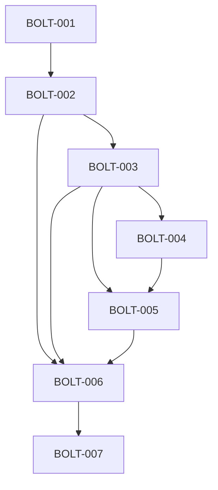

# Daily Logic Challenge

# Development Plan

**Document ID:** DEV-PLAN-001  
**Version:** 1.0.0  
**Status:** Approved  
**Owner:** Product + Engineering Coordination  

---

# 1. Purpose

This document defines the **execution roadmap** for building the Daily Logic Challenge MVP using the Bolt system.

It breaks the system into:

- Feature slices
- Dependency order
- Bolt assignments
- Parallel execution opportunities
- MVP scope boundaries

---

# 2. Planning Principles

## DEV-PRINCIPLE-001

All work must be executed via approved Bolts.

---

## DEV-PRINCIPLE-002

Features must be built in vertical slices (end-to-end).

---

## DEV-PRINCIPLE-003

No feature is considered complete until:

- backend is implemented
- frontend is implemented
- tests are written
- documentation is updated

---

## DEV-PRINCIPLE-004

Independent features should be executed in parallel when dependencies allow.

---

# 3. MVP Scope Definition

The MVP includes:

- User authentication (Firebase)
- Daily Binary Puzzle gameplay
- Move validation
- Attempt tracking
- Leaderboard
- Basic statistics
- Puzzle scheduling (daily UTC)

Excluded from MVP:

- Hints system
- Multiplayer
- Achievements
- Seasonal events
- Advanced analytics
- Anti-cheat system

---

# 4. Feature Breakdown (Vertical Slices)

---

## FEATURE-001: Authentication

### Description

User login and identity management via Firebase.

### Includes

- Google login
- Email/password login
- JWT validation in backend
- User creation in DB

### Depends On

None

---

## FEATURE-002: Puzzle System

### Description

Daily puzzle delivery and retrieval system.

### Includes

- Puzzle storage
- DailyPuzzle mapping
- GET /puzzles/today
- Archive access

### Depends On

- FEATURE-001 (user identity optional for guest mode)

---

## FEATURE-003: Gameplay Engine

### Description

Core binary puzzle logic and attempt lifecycle.

### Includes

- Start attempt
- Move validation
- Completion detection
- Attempt persistence

### Depends On

- FEATURE-002

---

## FEATURE-004: Statistics System

### Description

User performance tracking.

### Includes

- Games played
- Completion stats
- Streak tracking
- Aggregation logic

### Depends On

- FEATURE-003

---

## FEATURE-005: Leaderboard System

### Description

Ranking system for completed puzzles.

### Includes

- Ranking logic
- Score calculation
- GET leaderboard endpoints

### Depends On

- FEATURE-003
- FEATURE-004

---

## FEATURE-006: Frontend Game UI

### Description

User-facing game interface.

### Includes

- Puzzle grid UI
- Move interaction
- Timer
- Validation feedback
- Results screen

### Depends On

- FEATURE-002
- FEATURE-003
- FEATURE-005

---

## FEATURE-007: Deployment & Operational Readiness

### Description

Build and deployment readiness for local, CI, staging, and production-like execution.

### Includes

- Local environment setup
- Build and test pipeline
- Environment variable templates
- Deployment report generation
- Production readiness validation

### Depends On

- FEATURE-001
- FEATURE-002
- FEATURE-003
- FEATURE-004
- FEATURE-005
- FEATURE-006

---

# 5. Bolt Plan (Execution Units)

---

## BOLT-001 — Authentication Core

### Scope

- Firebase integration
- Backend auth validation
- User creation

### Output

- Authenticated user system

### Owner Agent

Backend + Frontend

---

## BOLT-002 — Puzzle Infrastructure

### Scope

- Puzzle entity
- DailyPuzzle mapping
- Puzzle retrieval endpoints

### Depends On

BOLT-001

---

## BOLT-003 — Gameplay Engine Core

### Scope

- Attempt lifecycle
- Move validation engine
- Completion detection
- Score calculation (basic)

### Depends On

BOLT-002

---

## BOLT-004 — Statistics Engine

### Scope

- PlayerStatistics entity updates
- Aggregation logic
- Streak tracking

### Depends On

BOLT-003

---

## BOLT-005 — Leaderboard System

### Scope

- Ranking logic
- LeaderboardEntry persistence
- Query endpoints

### Depends On

BOLT-003
BOLT-004

---

## BOLT-006 — Frontend Game UI

### Scope

- Game screen
- Puzzle interaction
- Move submission integration
- Automatic completion finalization
- Results screen

### Depends On

BOLT-002
BOLT-003
BOLT-005

---

## BOLT-007 — Deployment & Operational Readiness

### Scope

- Local environment setup
- Build pipeline
- Test pipeline integration
- Environment configuration templates
- Deployment report

### Depends On

BOLT-001
BOLT-002
BOLT-003
BOLT-004
BOLT-005
BOLT-006

---

# 6. Parallel Execution Plan

---

# 7. Execution Strategy

## Phase 1 — Foundation

- BOLT-001 (Auth)
- BOLT-002 (Puzzle System)

---

## Phase 2 — Core Gameplay

- BOLT-003 (Gameplay Engine)

---

## Phase 3 — Progression Systems

- BOLT-004 (Statistics)
- BOLT-005 (Leaderboard)

---

## Phase 4 — User Experience

- BOLT-006 (Frontend UI)

---

## Phase 5 — Deployment Readiness

- BOLT-007 (Deployment & Operational Readiness)

---

# 8. Agent Assignment Model

---

## Backend Agent

- BOLT-001
- BOLT-002
- BOLT-003
- BOLT-004
- BOLT-005

---

## Frontend Agent

- BOLT-001 (auth UI)
- BOLT-006

---

## DevOps Agent

- BOLT-007

---

## Tester Agent

- All BOLTs validation

---

## Reviewer Agent

- All BOLTs compliance checks

---

# 9. Risk Areas

---

## RISK-001 — Gameplay Engine Complexity

Move validation and puzzle rules must be carefully tested.

Mitigation:

- strong unit test coverage
- isolated validation module

---

## RISK-002 — Leaderboard Consistency

Ranking must remain deterministic.

Mitigation:

- precomputed leaderboard entries
- immutable attempts

---

## RISK-003 — Firebase Dependency

External auth dependency may cause integration delays.

Mitigation:

- mock auth layer for local development

---

# 10. MVP Definition of Done

The MVP is complete when:

- User can log in
- Daily puzzle is accessible
- Player can complete a puzzle
- Attempts are stored
- Leaderboard is visible
- Stats are updated
- UI is fully functional

---

# 11. Future Enhancements (Post-MVP)

- Hint system
- Puzzle difficulty auto-tuning
- Multiplayer challenges
- Seasonal events
- Replay sharing
- Anti-cheat detection

---

# 12. Execution Philosophy

This system is designed for:

> Parallel AI-agent software construction using structured, dependency-aware execution units (Bolts).

Each Bolt is:

- independently understandable
- independently testable
- independently reviewable

---

# End of Development Plan
