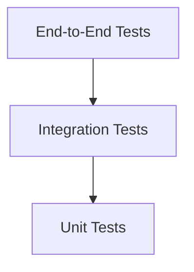
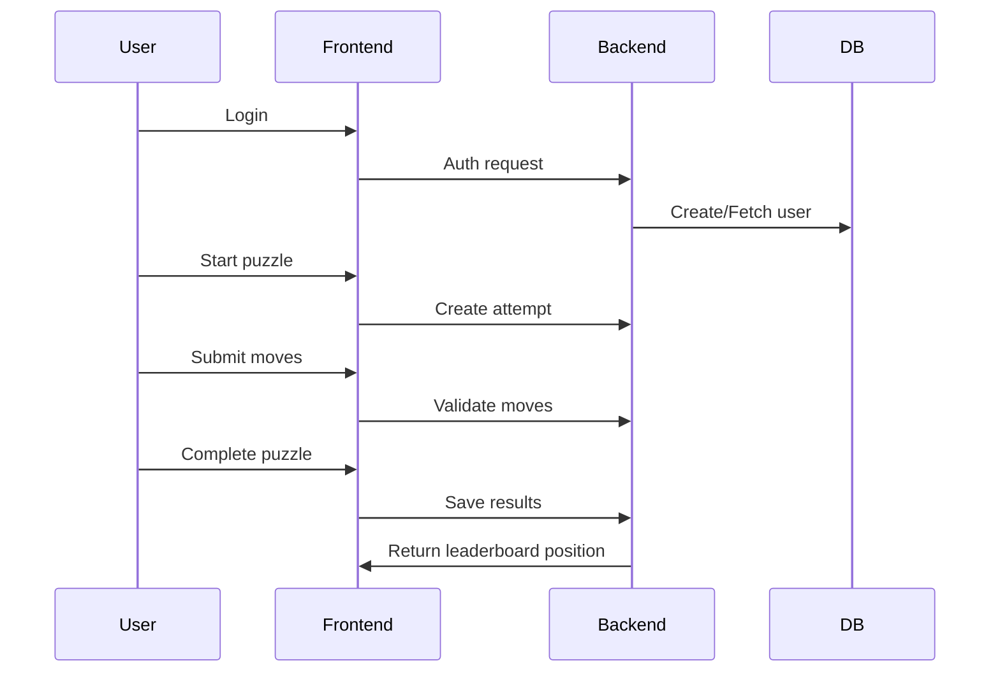

# Daily Logic Challenge

# Testing Strategy

**Document ID:** TEST-001  
**Version:** 1.0.0  
**Status:** Approved  
**Owner:** QA + Engineering Systems Team  

---

# 1. Purpose

This document defines the testing philosophy, structure, and execution rules for the Daily Logic Challenge system.

It ensures that all Bolts, features, and agents produce **verifiable and deterministic outcomes**.

---

# 2. Testing Principles

## TEST-PRINCIPLE-001

All critical game logic must be testable in isolation.

---

## TEST-PRINCIPLE-002

No Bolt is considered complete without passing its test suite.

---

## TEST-PRINCIPLE-003

Tests define correctness—not implementation.

---

## TEST-PRINCIPLE-004

Game rules must be validated at multiple levels (unit + integration).

---

## TEST-PRINCIPLE-005

Regression prevention is mandatory for gameplay logic.

---

# 3. Testing Pyramid



---

# 4. Test Categories

---

## 4.1 Unit Tests

### Scope

- Puzzle validation logic
- Move validation rules
- Statistics calculations
- Scoring functions

### Characteristics

- Fast
- Isolated
- No database dependency

### Tools (recommended)

- Jest (backend)
- Jasmine/Karma or Jest (frontend)

---

## 4.2 Integration Tests

### Scope

- API endpoints
- Database interactions
- Authentication flow (mocked Firebase)

### Examples

- POST /attempts/start creates attempt
- POST /attempts/move updates state
- GET /leaderboard returns correct ranking

---

## 4.3 End-to-End Tests

### Scope

- Full user flow
- UI → API → DB → response loop

### Example Flow



---

# 5. Game Logic Testing Strategy

This is the most critical part of the system.

---

## 5.1 Puzzle Validation Tests

Must verify:

- Only 0 and 1 allowed
- No more than 2 identical consecutive values
- Row uniqueness rules
- Column uniqueness rules
- Puzzle completeness detection

---

## 5.2 Move Validation Tests

Must verify:

- Valid move accepted
- Invalid move rejected
- State remains consistent
- Move counter increments correctly

---

## 5.3 Completion Tests

Must verify:

- Puzzle is correctly marked complete
- Score calculation is correct
- Attempt is immutable after completion
- Leaderboard update is triggered

---

## 5.4 Determinism Tests

Same puzzle + same moves = same result always.

---

# 6. Test Strategy per Bolt

Each Bolt must include:

- Unit tests
- Integration tests (if applicable)
- Acceptance test cases

---

## Bolt Test Mapping

| Bolt | Required Tests |
|------|----------------|
| BOLT-001 | Auth integration tests |
| BOLT-002 | Puzzle generation + retrieval tests |
| BOLT-003 | Gameplay engine unit + integration tests |
| BOLT-004 | Statistics correctness tests |
| BOLT-005 | Leaderboard ranking tests |
| BOLT-006 | UI + E2E tests |

---

# 7. Acceptance Criteria Format

Each Bolt must define testable acceptance criteria:

```markdown
- GIVEN a valid puzzle
- WHEN user completes it correctly
- THEN attempt is marked completed
- AND leaderboard is updated
```

---

# 8. Mocking Strategy

---

## 8.1 Firebase

Firebase must be mocked for:

- Unit tests
- Integration tests

Only real integration allowed in E2E environment.

---

## 8.2 Database

- Use in-memory DB or test PostgreSQL instance
- Reset state between tests
- Seed deterministic data

---

# 9. Test Data Strategy

---

## 9.1 Deterministic Puzzles

All test puzzles must be:

- pre-generated
- reproducible
- stored in fixtures

---

## 9.2 Seed Data

Used for:

- leaderboard tests
- statistics tests
- multi-user scenarios

---

# 10. Regression Strategy

---

## TEST-REG-001

Any bug fixed must include a regression test.

---

## TEST-REG-002

Regression tests must fail before fix is applied.

---

## TEST-REG-003

No bug fix is considered complete without regression coverage.

---

# 11. Performance Testing (Future MVP+)

Not required for MVP but planned:

- leaderboard query performance
- puzzle retrieval latency
- concurrent attempt handling

---

# 12. AI Agent Testing Rules

---

## TEST-AGENT-001

Agents must not mark a Bolt as complete without passing tests.

---

## TEST-AGENT-002

Test failures must block progression to Reviewer Agent.

---

## TEST-AGENT-003

Any missing test case must be logged as an Open Question.

---

# 13. Definition of Done (Testing Perspective)

A Bolt is valid only if:

- Unit tests pass
- Integration tests pass (if applicable)
- No regressions introduced
- Acceptance criteria verified
- Edge cases covered
- Test logs recorded

---

# 14. Coverage Expectations

Minimum coverage targets:

- Game logic: 90%+
- API layer: 80%+
- UI: 70%+

---

# 15. Observability of Tests

Test results must be:

- reproducible
- logged
- reviewable by Reviewer Agent

---

# 16. Future Enhancements

- AI-generated test cases per Bolt
- Mutation testing for game logic
- Visual puzzle validation testing
- Load testing for leaderboard scaling
- Automated edge-case discovery

---

# 17. System Philosophy

Testing is not a phase.

Testing is a **gatekeeping layer for all agent execution**.

No code enters the system without verification.

---

# End of Testing Strategy
