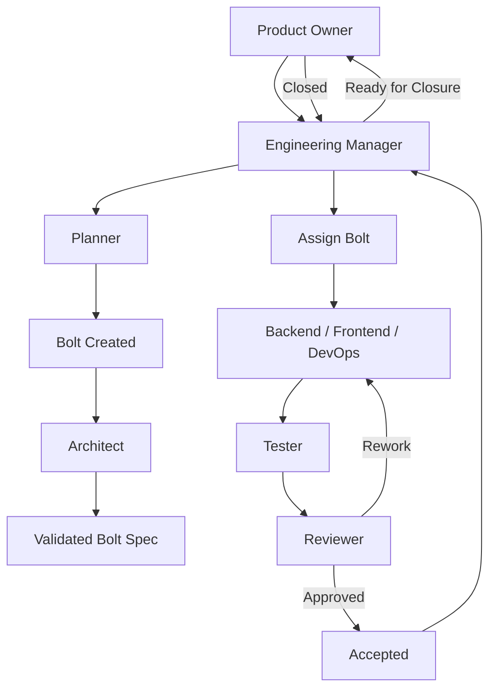
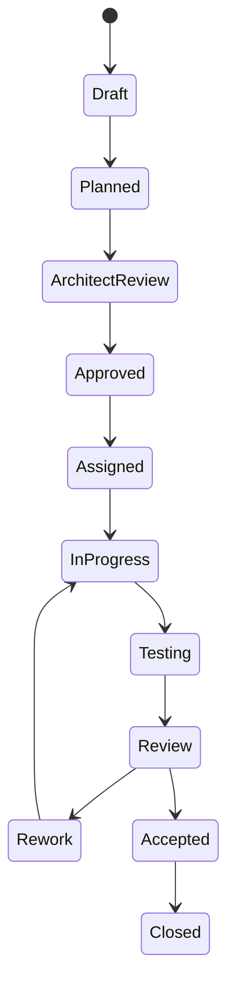

# Agent Workflow Specification

**Document ID:** WORKFLOW-009  
**Version:** 1.0.0  
**Status:** Active  
**Owner:** Engineering Manager  

---

# 1. Purpose

This document defines the end-to-end execution workflow of the AI Engineering System.

It describes:

- How work is created
- How it is decomposed
- How it is executed
- How it is validated
- How it is accepted

The workflow is centered around the **Bolt lifecycle**.

---

# 2. Core Principle

All work in the system MUST flow through a Bolt.

No implementation, testing, or review may occur outside a Bolt context.

---

# 3. High-Level Workflow

---

# 4. Detailed Workflow Phases

---

# 4.1 Planning Phase

## Owner: Engineering Manager + Planner + Architect

### Steps:

1. Product Owner defines intent (feature or objective)
2. Engineering Manager initiates planning session
3. Planner decomposes intent into Bolts
4. Architect validates feasibility and structure
5. Bolts are created in Draft state

### Output:

- One or more Bolt specifications
- Open questions (if any)
- Dependency graph

---

# 4.2 Bolt Approval Phase

## Owner: Architect + Engineering Manager

### Steps:

1. Architect validates technical correctness
2. EM validates completeness and executability
3. Missing details are escalated back to Planner or PO
4. Bolt transitions to **Approved**
5. All state transitions MUST be reflected in the EM Dashboard event stream.

### Gate Rule:

No Bolt may proceed without:
- Clear scope
- Defined acceptance criteria
- No unresolved critical questions

---

# 4.3 Assignment Phase

## Owner: Engineering Manager

### Steps:

1. EM reviews approved Bolts
2. EM assigns Bolts to agents:
   - Backend
   - Frontend
   - DevOps
3. EM ensures dependencies are satisfied
4. Bolt transitions to **Assigned**

---

# 4.4 Execution Phase

## Owner: Implementation Agents

### Steps:

1. Assigned agent executes Bolt
2. Implementation must follow:
   - Architecture rules
   - Conventions
   - Bolt scope only
3. Work remains within Bolt boundaries

### Output:

- Code changes
- Unit/integration changes
- Local validations

---

# 4.5 Testing Phase

## Owner: Tester Agent

### Steps:

1. Tester executes validation against acceptance criteria
2. Tester runs:
   - Unit tests
   - Integration tests
   - E2E tests (if applicable)
3. Tester produces Test Report

### Outcomes:

- PASS → proceed to Review
- FAIL → return to Implementation

---

# 4.6 Review Phase

## Owner: Reviewer Agent

### Steps:

1. Reviewer evaluates:
   - Architecture compliance
   - Code quality
   - Convention adherence
   - Test sufficiency
2. Reviewer produces Review Report

### Outcomes:

- APPROVED → proceed to EM closure
- REQUIRES REWORK → return to Implementation
- REJECTED → escalated to EM

---

# 4.7 Closure Phase

## Owner: Product Owner, coordinated by Engineering Manager

### Steps:

1. EM validates:
   - Tester passed
   - Reviewer approved
2. EM presents the Accepted Bolt to the Product Owner
3. Product Owner accepts or rejects final closure
4. If accepted, Product Owner marks Bolt as CLOSED
5. EM records metrics and finalizes logs

---

# 5. State Machine

---

# 6. Role Interactions

## Product Owner
- Defines what should be built
- Approves final outcomes

---

## Engineering Manager
- Orchestrates workflow
- Assigns work
- Tracks progress
- Ensures consistency
- Coordinates Product Owner closure

---

## Planner
- Decomposes work into Bolts
- Defines acceptance criteria
- Identifies dependencies

---

## Architect
- Validates system design
- Ensures structural correctness

---

## Implementation Agents
- Execute Bolt tasks
- Produce working code

---

## Tester
- Validates functional correctness
- Ensures acceptance criteria are met

---

## Reviewer
- Validates architectural and code quality
- Approves or rejects implementation

---

# 7. Rules of the Workflow

## WF-RULE-001

No work may bypass the Bolt lifecycle.

---

## WF-RULE-002

Each Bolt must pass through Tester and Reviewer before closure.

---

## WF-RULE-003

No agent may operate outside its defined role.

---

## WF-RULE-004

All state transitions must be logged.

---

## WF-RULE-005

The Engineering Manager is the only agent allowed to close a Bolt.

---

# 8. Escalation Rules

## To Planner
- Missing requirements
- Ambiguous scope

## To Architect
- Design inconsistencies
- Structural violations

## To Engineering Manager
- Blocked execution
- Conflicting decisions
- Workflow breakdowns

---

# 9. Logging Requirements

Every transition must be recorded in:

`docs/agents-log.md`

Minimum required fields:

- Timestamp (UTC)
- Bolt ID
- Previous state
- New state
- Agent responsible
- Reason

---

# 10. Quality Guarantees

A Bolt is only valid if:

- Fully defined before execution
- Tested successfully
- Reviewed successfully
- Approved by Engineering Manager

---

# 11. Workflow Philosophy

This system is designed to ensure:

- Deterministic execution of software development
- Traceable decisions across all stages
- Separation of concerns between agents
- Measurable AI-assisted engineering performance

---

# End of Agent Workflow Specification
