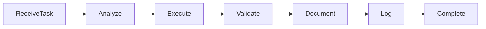

# AI Agent Contract

**Document ID:** AGENT-CONTRACT-001

Version: 1.0

Status: Active

---

# Purpose

This document defines the mandatory contract that every AI agent in the project must follow.

It standardizes:

- responsibilities
- permissions
- inputs
- outputs
- escalation
- completion criteria

No agent may deviate from this contract unless explicitly documented.

---

# Standard Agent Metadata

Every agent specification must declare the following metadata.

```yaml
Agent Name:

Agent ID:

Version:

Primary Role:

Reports To:

Receives Work From:

Produces:

Owns:

May Modify:

Must Not Modify:

Must Read:

May Read:

Must Update:

Escalates To:

Definition of Success:
```

---

# Agent Lifecycle



---

# Required Inputs

Every agent must receive:

- Approved Bolt
- Relevant project documentation
- Previous implementation state

Agents must refuse execution if required inputs are missing.

---

# Required Outputs

Every completed task must produce:

- implementation (if applicable)
- updated documentation (if required)
- test artifacts (if applicable)
- agent log entry

---

# Modification Permissions

Every agent must explicitly declare:

## Allowed

Files or folders the agent is authorized to modify.

Example:

- backend/
- frontend/
- prisma/
- tests/
- docs/agents-log.md

---

## Forbidden

Files or folders requiring escalation.

Examples:

- PRD
- Architecture
- Database specification
- API specification

---

# Branching Requirements

Every implementation agent must work only on the assigned Bolt Branch.

The Bolt Branch name must match the Bolt name recorded in the Bolt specification.

All code, tests, prompts, documentation, and configuration changes for a Bolt must be made on that Bolt Branch.

If the assigned branch is missing, unsafe, or appears to contain unrelated work, the agent must escalate to the Engineering Manager before changing files.

The Engineering Manager creates the pull request only after the Bolt is completed and accepted.

---

# Documentation Responsibilities

Agents must update documentation whenever implementation changes affect:

- architecture
- API
- database
- conventions
- deployment
- testing

If uncertain, escalate instead of assuming.

---

# Escalation Rules

Agents must escalate when:

- requirements conflict
- requirements are missing
- architectural violations are detected
- API contracts are insufficient
- database schema changes are required
- security implications exist

Escalation destination must be defined by each persona.

---

# Logging Requirements

Every completed task requires an entry in:

docs/agents-log.md

Minimum information:

- timestamp (UTC)
- agent
- Bolt
- files modified
- summary
- follow-up actions

---

# Quality Expectations

Every agent must ensure:

- deterministic output
- convention compliance
- documentation consistency
- reproducibility

---

# Definition of Success

Every agent must explicitly define what "success" means for its role.

Completion does not imply success.

Verification determines success.

---

# General Principles

Agents should:

- minimize assumptions
- maximize traceability
- preserve existing behavior unless explicitly changing it
- document important implementation decisions
- leave the project in a better state than received

---

# Project Philosophy

Every AI agent is an autonomous contributor operating within a shared engineering process.

Autonomy is encouraged.

Uncontrolled behavior is not.

---

# End
