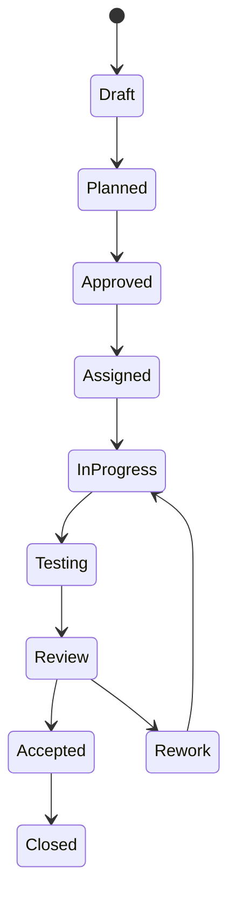

# Bolt Specification

**Document ID:** BOLT-SPEC-013
**Version:** 1.0.0  
**Status:** Active  
**Owner:** Engineering Manager

---

# 1. Purpose

A **Bolt** is the smallest independently deliverable unit of work within the project.

A Bolt represents a complete engineering task that can be:

- Planned
- Implemented
- Tested
- Reviewed
- Accepted
- Closed

A Bolt is intentionally larger than a single coding task but smaller than a feature or epic.

It should represent one coherent vertical slice of functionality or infrastructure.

---

# 2. Bolt Principles

## BOLT-PRINCIPLE-001

Every Bolt must have exactly one primary objective.

---

## BOLT-PRINCIPLE-002

Every Bolt must be independently understandable.

---

## BOLT-PRINCIPLE-003

A Bolt must be independently testable.

---

## BOLT-PRINCIPLE-004

A Bolt must have measurable acceptance criteria.

---

## BOLT-PRINCIPLE-005

No work may begin without an Approved Bolt.

---

# 3. Bolt Lifecycle



---

# 4. Bolt States

| State | Description |
|--------|-------------|
| Draft | Initial idea |
| Planned | Scope defined |
| Approved | Ready for execution |
| Assigned | Assigned to implementation agents |
| In Progress | Active implementation |
| Testing | Validation underway |
| Review | Awaiting technical review |
| Rework | Changes requested |
| Accepted | Approved by Reviewer |
| Closed | Accepted by Product Owner |

---

# 5. Ownership by State

| State | Owner |
|---------|-------|
| Draft | Product Owner / Engineering Manager |
| Planned | Planner |
| Approved | Architect + Engineering Manager |
| Assigned | Engineering Manager |
| In Progress | Implementation Agent(s) |
| Testing | Tester |
| Review | Reviewer |
| Accepted | Engineering Manager |
| Closed | Product Owner |

---

# 6. Required Metadata

Every Bolt must define:

```yaml
Bolt ID:
Bolt Name:
Title:
Bolt Branch:
Status:
Priority:
Type:
Created:
Last Updated:

Feature:

Requirement IDs:

Estimated Complexity:

Dependencies:

Assigned Agents:

Reviewer:

Tester:

Target Bolt:

Related ADRs:
```

---

# 7. Bolt Types

Supported Bolt types:

- Feature
- Enhancement
- Bug Fix
- Technical Debt
- Documentation
- Infrastructure
- Research
- Refactoring

---

# 8. Complexity Scale

| Level | Description |
|---------|-------------|
| XS | Less than 2 hours |
| S | Half day |
| M | 1–2 days |
| L | Several days |
| XL | Split into multiple Bolts |

If estimated complexity exceeds **L**, the Planner should consider splitting the work into smaller Bolts.

---

# 9. Required Sections

Every Bolt document must contain:

1. Objective
2. Background
3. Scope
4. Out of Scope
5. Requirements Covered
6. Dependencies
7. Deliverables
8. Acceptance Criteria
9. Risks
10. Open Questions
11. Implementation Notes
12. Testing Notes
13. Review Notes
14. Completion Summary

---

# 10. Required Deliverables

Depending on the Bolt type, expected deliverables may include:

- Source code
- Tests
- Documentation
- Database migrations
- API updates
- ADRs
- Deployment changes

The Planner should identify expected deliverables during Bolt creation.

---

# 11. Required Artifacts

Each completed Bolt should generate:

- Implementation Package
- Test Report
- Review Report
- Agent Log entry
- Pull Request created by the Engineering Manager after acceptance

Optional:

- ADR
- Experiment record
- Benchmark report

---

# 12. Acceptance Criteria

Acceptance criteria should be written using the **Given / When / Then** format.

Example:

```text
Given an authenticated user

When they request today's puzzle

Then the API returns the scheduled puzzle for the current UTC day.
```

Acceptance criteria must be objective and testable.

---

# 13. Dependency Rules

A Bolt may depend only on:

- Approved Bolts
- Closed Bolts
- Existing project documentation

Circular dependencies are not permitted.

---

## 13.1 Bolt Branch Rules

Every implementation Bolt must define a Bolt Branch.

The Bolt Name is the repository-safe, stable Bolt identifier used for git branch naming. It may differ from the human-readable Title.

The Bolt Branch name MUST match the Bolt Name.

All changes for the Bolt, including source code, tests, prompts, documentation, and supporting configuration, must be made on the Bolt Branch.

If the Bolt Name cannot be used safely as a git branch name, the Engineering Manager must resolve the Bolt Name before assigning the Bolt.

The Bolt Branch remains the sole change branch until the Bolt is accepted and the Engineering Manager creates the pull request.

---

# 14. State Transition Rules

Only the appropriate role may move a Bolt between states.

| Transition | Responsible Role |
|------------|------------------|
| Draft → Planned | Planner |
| Planned → Approved | Architect + Engineering Manager |
| Approved → Assigned | Engineering Manager; records Bolt Branch |
| Assigned → In Progress | Implementation Agent; creates or checks out Bolt Branch |
| In Progress → Testing | Implementation Agent |
| Testing → Review | Tester |
| Review → Accepted | Reviewer |
| Accepted → Closed | Engineering Manager creates PR, then Product Owner accepts outcome |

---

# 15. Metrics

Each Bolt should record:

- Planning duration
- Implementation duration
- Testing duration
- Review duration
- Total cycle time
- Number of review iterations
- Bugs found
- Bugs fixed
- Documentation updates
- Human interventions

These metrics support process improvement and AI model evaluation.

---

# 16. Logging

Every state transition must be recorded in:

`docs/agents-log.md`

Each entry should include:

- Timestamp (UTC)
- Previous state
- New state
- Responsible agent
- Summary of changes

---

# 17. Relationship to ADRs

If a Bolt introduces or requires a significant architectural decision, it must reference the associated ADR(s).

No architectural change should be merged without an approved ADR.

---

# 18. Completion Criteria

A Bolt is complete only when:

- Acceptance criteria are satisfied
- Required tests pass
- Review is approved
- All changes are contained on the Bolt Branch
- Engineering Manager creates a pull request from the Bolt Branch after acceptance
- Pull request description explains changes, problems found, rework, fixes, and validation
- Documentation is updated
- Agent log is updated
- Product Owner accepts the outcome

---

# 19. Bolt Philosophy

A Bolt is more than a task.

It is a **traceable engineering artifact** that captures the complete lifecycle of a unit of work, enabling collaboration between humans and AI agents while preserving accountability, reproducibility, and project history.

---

# End of Bolt Specification
