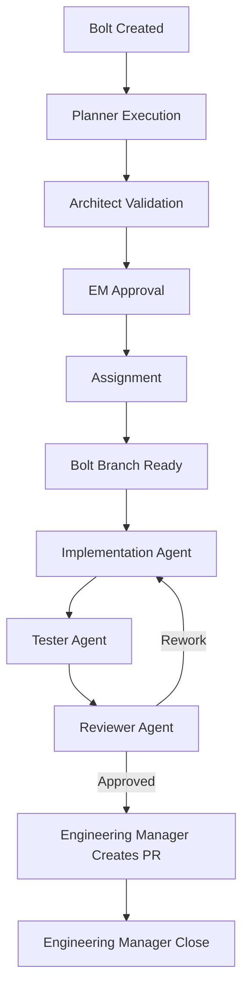
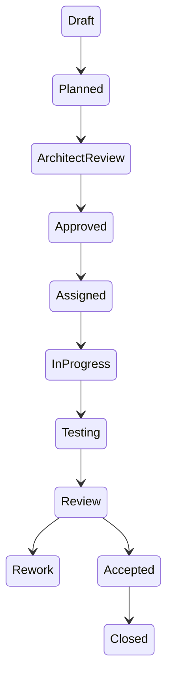

# Bolt Runtime Protocol

**Document ID:** RUNTIME-015
**Version:** 1.0.0  
**Status:** Active  
**Purpose:** Defines how a Bolt is executed end-to-end in the AI Engineering System

---

# 1. Purpose

This document defines the **operational runtime behavior** of a Bolt.

It answers:

> How does a Bolt actually move through the system in practice?

This is the missing bridge between:
- workflow design
- and real execution

---

# 2. Core Principle

A Bolt is executed as a **strict state machine with controlled agent handoffs**.

No agent may skip steps.

No state transition is implicit.

All transitions must be logged.

---

# 3. Execution Model

Each Bolt follows this execution sequence:



---

# 4. Bolt State Machine



---

# 5. Runtime Execution Rules

## RULE R1 — Strict Sequential Execution

A Bolt MUST pass through:

1. Planner
2. Architect
3. Engineering Manager approval
4. Assignment
5. Implementation
6. Tester
7. Reviewer
8. Engineering Manager closure

No step may be skipped.

---

## RULE R2 — Single Active State

A Bolt MUST always be in exactly ONE state.

No parallel conflicting states allowed.

---

## RULE R3 — Agent Isolation

Each agent:

- Only operates within its assigned phase
- Cannot modify other phases’ outputs
- Cannot skip validation layers

---

## RULE R4 — Logging Requirement

Every transition MUST generate a log entry:

```yaml
timestamp: UTC
bolt_id: BOLT-XXX
agent: <agent_name>
from_state: <state>
to_state: <state>
event: <description>
```

Stored in:
`docs/agents-log.md`

---

## RULE R5 — Tester as Gatekeeper

A Bolt CANNOT proceed to Reviewer unless:

- All acceptance criteria are executed
- Test report exists
- No critical failures remain unresolved

---

## RULE R6 — Reviewer as Final Technical Gate

Reviewer decision is final technical validation:

- APPROVED → EM can close Bolt
- REWORK → returns to Implementation
- REJECTED → escalates to EM

---

## RULE R7 — EM is the Only Closure Authority

Only Engineering Manager can:

- mark Bolt as CLOSED
- finalize lifecycle
- publish completion metrics

---

## RULE R8 — Bolt Branch Required for Implementation

Every implementation Bolt MUST be executed on a dedicated Bolt Branch.

The Bolt Branch name MUST match the Bolt name recorded in the Bolt specification.

All source, test, prompt, and documentation changes for the Bolt MUST be made only on that branch.

If the branch is missing, unsafe, or already contains unrelated work, the implementation agent MUST escalate to the Engineering Manager before changing files.

---

## RULE R9 — Accepted Bolts Require an EM Pull Request

When a Bolt is completed and accepted, the Engineering Manager MUST create the pull request from the Bolt Branch.

The PR description MUST include:

- Detailed explanation of changes made
- Problems found during implementation, testing, or review
- Rework performed and how each issue was fixed
- Validation performed
- Links or references to related test and review reports when available

---

# 6. Runtime Execution Phases

---

## Phase 1 — Planning Runtime

Executed by Planner:

- Decompose intent into Bolt structure
- Define acceptance criteria
- Identify dependencies
- Output: Draft Bolt

---

## Phase 2 — Architecture Runtime

Executed by Architect:

- Validate feasibility
- Check system design consistency
- Approve or reject Bolt

---

## Phase 3 — EM Approval Runtime

Executed by Engineering Manager:

- Confirm completeness
- Ensure readiness for execution
- Assign implementation agents
- Record the Bolt Branch name from the Bolt name

---

## Phase 4 — Implementation Runtime

Executed by:
- Backend Agent
- Frontend Agent
- DevOps Agent

Rules:
- Must follow Bolt scope only
- Must not modify acceptance criteria
- Must log implementation decisions
- Must create or check out the Bolt Branch before changing files
- Must keep all Bolt changes on the Bolt Branch

---

## Phase 5 — Testing Runtime

Executed by Tester:

- Validate acceptance criteria
- Execute test cases
- Generate test report
- Output PASS/FAIL

---

## Phase 6 — Review Runtime

Executed by Reviewer:

- Validate architecture compliance
- Validate code quality
- Validate test coverage
- Decide outcome

---

## Phase 7 — Closure Runtime

Executed by EM:

- Confirm Tester + Reviewer approval
- Create pull request from the Bolt Branch after acceptance
- Include detailed changes, problems, rework, fixes, and validation in the PR description
- Close Bolt
- Record metrics
- Finalize logs

---

# 7. Failure Handling Model

---

## 7.1 Implementation Failure

→ Returns to Implementation

---

## 7.2 Test Failure

→ Returns to Implementation

Tester must:
- log failure
- specify reproduction steps

---

## 7.3 Review Failure

→ Returns to Implementation OR EM escalation

---

## 7.4 Architectural Failure

→ Returns to Planner or Architect depending on severity

---

# 8. Event Model (System Truth Layer)

Every runtime action emits an event:

```json
{
  "timestamp": "UTC",
  "bolt_id": "BOLT-001",
  "agent": "Tester",
  "event_type": "STATE_TRANSITION",
  "from": "InProgress",
  "to": "Testing",
  "branch_name": "BOLT-001-game-shell",
  "message": "All test cases executed successfully"
}
```

Implementation and closure events MUST include `branch_name`. Closure events MUST include a pull request reference when the PR exists.

---

# 9. Model Comparison Support (IMPORTANT)

This runtime protocol is designed to be:

> model-agnostic

Meaning:

- same Bolt
- same workflow
- same evaluation criteria
- different model → different outcomes

This enables:

- branch-based comparison (your git strategy)
- reproducibility of results
- structured benchmarking

---

# 10. EM Dashboard Integration

Every runtime transition MUST update:

- Bolt state in dashboard
- agent activity panel
- blocker panel (if applicable)
- timeline metrics

---

# 11. Success Criteria for Runtime System

The runtime system is valid if:

- Every Bolt can be executed end-to-end
- No step is ambiguous
- No agent bypass occurs
- All transitions are logged
- Tester + Reviewer enforce correctness independently

---

# 12. Philosophy

This runtime system defines:

> “Software engineering as a deterministic state machine operated by specialized agents.”

It transforms development from:
- human-driven coordination

into:
- structured agent execution pipeline

---

# End of Runtime Protocol
