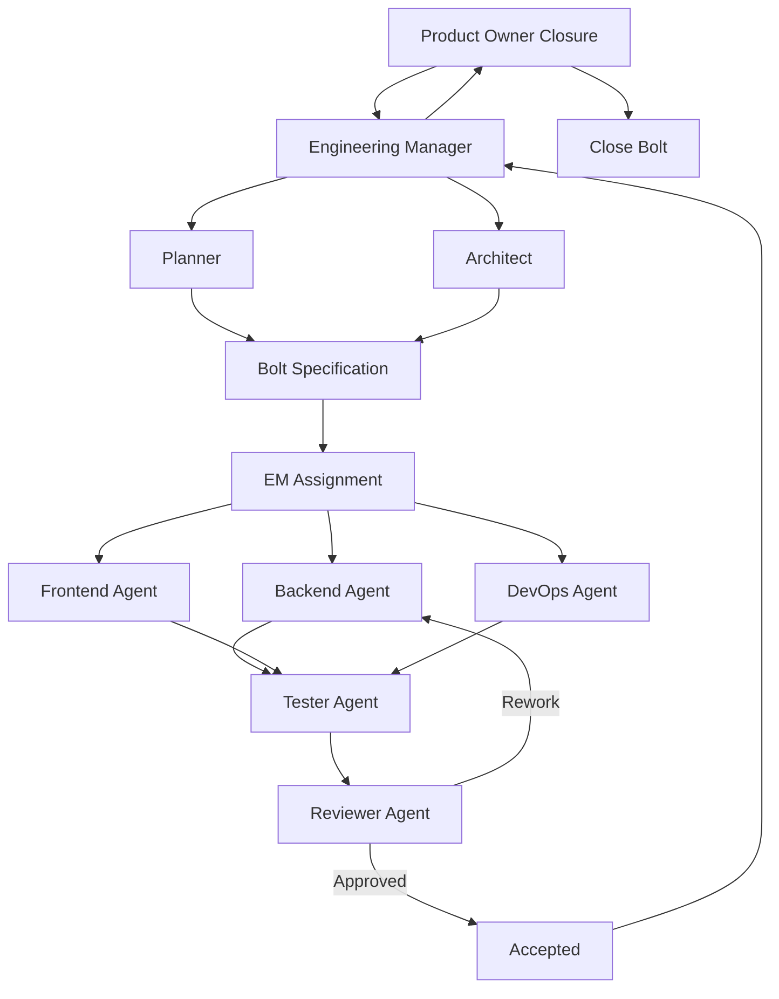
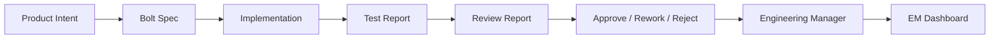
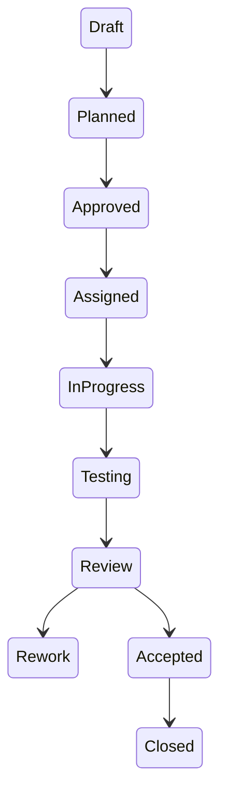

# System Architecture Overview

This document describes the full relationship between agents, artifacts, and system layers.

---

# 1. High-Level System Structure

---

# 2. System Layers

## 2.1 Control Layer (Decision Makers)

- Engineering Manager (EM)
- Planner
- Architect

These define:
- what is built
- how it is structured
- how it is decomposed

---

## 2.2 Execution Layer (Builders)

- Backend Agent
- Frontend Agent
- DevOps Agent

These implement:
- functionality
- infrastructure
- UI

---

## 2.3 Validation Layer (Truth System)

- Tester Agent
- Reviewer Agent

These ensure:
- correctness (Tester)
- quality & architecture (Reviewer)

---

## 2.4 Observability Layer

- EM Dashboard
- Agent Logs
- Reports

These provide:
- system visibility
- traceability
- metrics

---

# 3. Artifact Relationships

---

# 4. State Flow Across System

---

# 5. Key Insight

This system is designed as a:

> multi-layer deterministic engineering pipeline

Where:

- Control Layer defines intent
- Execution Layer produces artifacts
- Validation Layer enforces correctness
- Observability Layer provides truth

---

# 6. Why This Matters

This diagram represents the core innovation of the system:

- separation of concerns across agents
- strict lifecycle enforcement via Bolts
- independent validation layers
- observable AI-driven engineering pipeline

---

# End of System Architecture Overview
